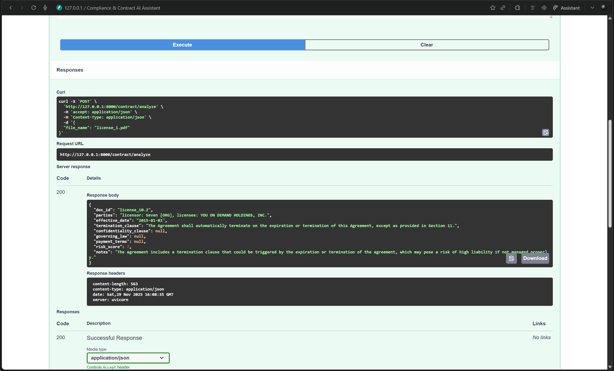

# Compliance & Contract AI Assistant

This project is an AI-powered assistant designed to facilitate compliance Q&A and automate contract analysis. It leverages Retrieval-Augmented Generation (RAG) to provide accurate answers from policy documents and extract structured information from legal contracts.

## Features

*   **Compliance Q&A**: Ask natural language questions about your policy documents and get concise answers with citations.
    
*   **Contract Analysis**: Automatically extract key information (e.g., parties, effective date, termination clauses, payment terms, governing law) from contracts into a structured JSON format.
    
*   **Smart Context Building**: For contract analysis, the system intelligently selects and organizes relevant sections of the contract (based on clause types) to fit within the LLM's context window, optimizing for accuracy and efficiency.
*   **PII Masking**: Automatically detects and masks Personally Identifiable Information (PII) within documents during ingestion to enhance privacy and security.
*   **Local LLM Integration**: Utilizes a locally loaded large language model (Phi-3-mini) for generation, reducing reliance on external API services for core functionalities.
*   **Vector Store**: Employs ChromaDB as a local vector store to manage and retrieve document embeddings efficiently.

## Architecture Overview

The application is built using FastAPI and organized into several modules:

*   **`api.py`**: The main FastAPI application, defining endpoints for health checks, compliance Q&A (`/query`), and contract analysis (`/contract/analyze`). It initializes the core services (`RAGService` and `ContractAnalyzer`) during startup.
*   **`rag_service.py`**: Implements the core RAG logic. It manages the connection to ChromaDB, loads the Phi-3-mini LLM, performs vector similarity search to retrieve relevant document chunks, and synthesizes answers based on the retrieved context.
*   **`contract_analyzer.py`**: Focuses on contract-specific analysis. It retrieves all document chunks for a given contract, categorizes them by detected clause types (e.g., parties, payment_terms), constructs a "Smart Context" for the LLM, and extracts structured data according to a predefined schema.
*   **`embeddings.py`**: Provides text embedding capabilities using the `SentenceTransformer` model ("sentence-transformers/all-mpnet-base-v2"). Embeddings are used for vector similarity searches in ChromaDB.
*   **`ingest.py`**: Handles the data preparation pipeline. It extracts text from PDF documents (located in `docs/policies` and `docs/contracts`), splits the text into manageable chunks, masks PII, generates embeddings for each chunk, and stores them in ChromaDB along with metadata (including detected clause types).
*   **`pii.py`**: Contains functionality for detecting and masking PII using spaCy's Named Entity Recognition (NER) model. It replaces identified entities (PERSON, ORG, GPE) with `[LABEL]` placeholders.
*   **`schemas.py`**: Defines Pydantic models for data validation and serialization, including request/response bodies for the API and the `ContractSchema` for structured contract analysis results.

## Setup and Installation

1.  **Clone the repository:**
    ```bash
    git clone https://github.com/your-repo/compliance-contract-ai.git
    cd compliance-contract-ai
    ```

2.  **Create a virtual environment and install dependencies:**
    ```bash
    python -m venv venv
    .\venv\Scripts\activate # On Windows
    source venv/bin/activate # On macOS/Linux
    pip install -r requirements.txt
    ```

3.  **Download the spaCy English model:**
    This is required by `pii.py` for PII masking.
    ```bash
    python -m spacy download en_core_web_sm
    ```

4.  **Prepare your documents:**
    Place your policy PDF files in `project/docs/policies/` and contract PDF files in `project/docs/contracts/`. Example documents are already provided.

## Data Ingestion

Before using the API, you need to ingest your documents into the ChromaDB vector store.
Run the ingestion script:
```bash
python project/app/ingest.py
```
This script will:
*   Extract text from all PDFs in `project/docs/policies/` and `project/docs/contracts/`.
*   Chunk the text and mask PII.
*   Generate embeddings and store them in `project/vector_store/`.

## Running the API

Start the FastAPI application:
```bash
uvicorn project.app.api:app --host 0.0.0.0 --port 8000 --reload
```
The `--reload` flag is optional and is useful for development as it restarts the server on code changes.

The API will be accessible at `http://0.0.0.0:8000`.

## API Endpoints

*   **`GET /`**:
    *   Returns a welcome message.
*   **`GET /health`**:
    *   **Response Model**: `HealthResponse`
    *   Checks the health of the LLM service.
    *   Returns `{"status": "healthy"}` if the LLM is loaded, otherwise `{"status": "degraded (LLM not loaded)"}`.
*   **`POST /query`**:
    *   **Request Model**: `QueryRequest` (e.g., `{"question": "What are the rules regarding data privacy?"}`)
    *   **Response Model**: `QueryResponse`
    *   Performs Compliance Q&A using RAG.
    *   Returns an `answer`, `citations` (list of source document filenames), and `similarity_scores`.
*   **`POST /contract/analyze`**:
    *   **Request Model**: `AnalyzeRequest` (e.g., `{"file_name": "affiliate_1.pdf"}`)
    *   **Response Model**: `ContractSchema`
    *   Analyzes a specified contract file. The `file_name` must correspond to a file previously ingested.
    *   Returns a structured JSON object containing extracted contract details like `parties`, `effective_date`, `termination_clause`, `payment_terms`, `risk_score`, and `notes`.

## Example Usage

You can interact with the API using tools like `curl`, Postman, or a custom Python script.

### Health Check
```bash
curl http://localhost:8000/health
```

### Compliance Q&A
```bash
curl -X POST http://localhost:8000/query \
     -H "Content-Type: application/json" \
     -d '{"question": "What are the visa application rules?", "collection_name": "compliance_contract_docs"}'
```

### Contract Analysis
```bash
curl -X POST http://localhost:8000/contract/analyze \
     -H "Content-Type: application/json" \
     -d '{"file_name": "service_1.pdf"}'
